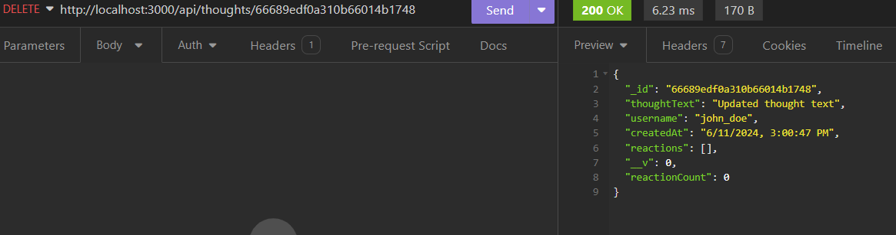

# Social Network api

## User Story
```
AS A social media startup
I WANT an API for my social network that uses a NoSQL database
SO THAT my website can handle large amounts of unstructured data
```

## Acceptance Criteria

```
GIVEN a social network API
WHEN I enter the command to invoke the application
THEN my server is started and the Mongoose models are synced to the MongoDB database
WHEN I open API GET routes in Insomnia for users and thoughts
THEN the data for each of these routes is displayed in a formatted JSON
WHEN I test API POST, PUT, and DELETE routes in Insomnia
THEN I am able to successfully create, update, and delete users and thoughts in my database
WHEN I test API POST and DELETE routes in Insomnia
THEN I am able to successfully create and delete reactions to thoughts and add and remove friends to a user’s friend list
```

## Table of Contents

- [Installation](#installation)
- [Usage](#usage)
- [Contributing](#contributing)
- [License](#license)
- [Credits](#credits)

## Installation

- Please download or clone on to your local machine to get started!
- `Node.js` and `MongoDB` are required to use this aplication.

The following dependencies are used and will need to be installed by navigating to the root directory and using the command `npm i`:
- mongoose
- dotenv
- express
- nodemon

## Usage

Please use the folloing link to see a quick walk through from Insomnia on how this application functions:
- https://drive.google.com/file/d/1YNKH5I0uPE05UMtHYwrrHSqh9--0KknY/view

Here are some screenshots of the get requests:

<br>
<br>

Here are some screenshots of the post requests:

<br>
<br>

Here are some screenshots of the put requests:

<br>
<br>

Here are some sceenshots of the delete requests:

<br>
<br>

Here are some screenshots of the friend post and delete:

<br>
<br>

## Contributing

If you would like to contribute to the project, follow these steps:
1. Fork the repository
2. Create a new branch (`git checkout -b feature`)
3. Make changes and commit them (`git commit -am 'Add feature'`)
4. Push to the branch (`git push origin feature`)
5. Create a pull request

## Credits

This link was used to help understand how to use mongoDB:

- https://www.mongodb.com/docs/manual/tutorial/getting-started/


## License

MIT License

Copyright (c) 2024 Storm Powell

Permission is hereby granted, free of charge, to any person obtaining a copy
of this software and associated documentation files (the "Software"), to deal
in the Software without restriction, including without limitation the rights
to use, copy, modify, merge, publish, distribute, sublicense, and/or sell
copies of the Software, and to permit persons to whom the Software is
furnished to do so, subject to the following conditions:

The above copyright notice and this permission notice shall be included in all
copies or substantial portions of the Software.

THE SOFTWARE IS PROVIDED "AS IS", WITHOUT WARRANTY OF ANY KIND, EXPRESS OR
IMPLIED, INCLUDING BUT NOT LIMITED TO THE WARRANTIES OF MERCHANTABILITY,
FITNESS FOR A PARTICULAR PURPOSE AND NONINFRINGEMENT. IN NO EVENT SHALL THE
AUTHORS OR COPYRIGHT HOLDERS BE LIABLE FOR ANY CLAIM, DAMAGES OR OTHER
LIABILITY, WHETHER IN AN ACTION OF CONTRACT, TORT OR OTHERWISE, ARISING FROM,
OUT OF OR IN CONNECTION WITH THE SOFTWARE OR THE USE OR OTHER DEALINGS IN THE
SOFTWARE.

